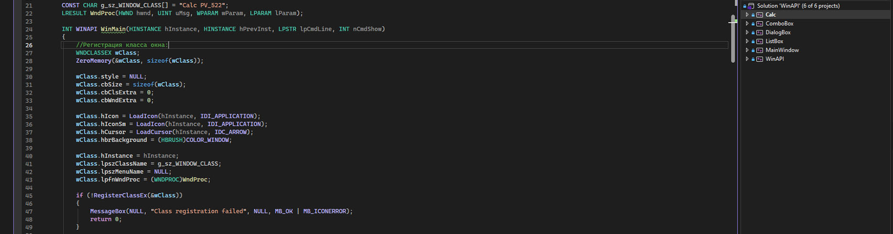

# Основы разработки приложений с использованием Win32 API

1. Что такое **Win32 API**
>Win32 API — это низкоуровневый интерфейс для работы с Windows.\
>Программа напрямую взаимодействует с оконной подсистемой ОС через:
>* регистрацию классов окон
>* создание окон и контролов
>* цикл сообщений
>* оконную процедуру (WndProc)\
>Win32 — событийно-ориентированная модель.\
Программа сама ничего не “отслеживает” — она получает сообщения от ОС.

2. Архитектура Windows-приложения
>Любое WinAPI-приложение состоит из 4 ключевых частей:
>* Регистрация класса окна
>* Создание окна
>* Цикл сообщений
>* Оконная процедура (WndProc - Window Procedure)

2.1 Регистрация класса окна
```
WNDCLASSEX wc = {};
wc.lpfnWndProc = WndProc;
wc.lpszClassName = "MyWindow";
RegisterClassEx(&wc);
```

> Класс окна — это описание будущих окон, а не само окно.
> (стиль, иконка, курсор, процедура обработки сообщений)

2.2 Создание окна
```
HWND hwnd = CreateWindowEx(...);
```

>После этого Windows:
>* создаёт внутреннюю структуру окна
>* регистрирует её в таблицах ОС
>* возвращает дескриптор окна (HWND)\
>👉 HWND — это не адрес, а дескриптор (handle) — значение, по которому Windows находит своё внутреннее окно.

3. Окно и контрол — одно и то же по сути
>В WinAPI:
>* главное окно — окно
>* кнопка — окно
>* edit — окно
>* listbox — окно

>Все они:
>* имеют свою структуру в ОС
>* имеют свой HWND
>* имеют свою оконную процедуру (встроенную или твою)

>Контролы — это дочерние окна.

4. Цикл сообщений (сердце программы)

```
MSG msg;
while (GetMessage(&msg, NULL, 0, 0))
{
    TranslateMessage(&msg);
    DispatchMessage(&msg);
}
```
>Windows кладёт события в очередь сообщений потока.
```DispatchMessage``` вызывает:
👉 ```WndProc(hwnd, msg, wParam, lParam);```

5. Оконная процедура (WndProc)

```LRESULT CALLBACK WndProc(HWND hwnd, UINT msg, WPARAM wParam, LPARAM lParam)```
>Это приёмная сообщений.

>Параметры:

>* ```hwnd``` — дескриптор окна получателя
>* ```msg``` — код сообщения (```WM_COMMAND, WM_PAINT, WM_CLOSE```…)
>* ```wParam``` — доп. информация (ID, флаги, коды)
>* ```lParam``` — доп. информация (HWND, указатели, координаты)

>Windows сама вызывает эту функцию.

6. Что такое HWND и как Windows хранит окна
>Когда создаётся окно, Windows:
>* выделяет память под внутреннюю структуру окна
>* регистрирует её в своих таблицах
>* возвращает программе дескриптор (HWND)

>```HWND``` — это ключ, по которому Windows находит свою структуру окна.
>Разработчик никогда не работает напрямую со структурой окна.

7. WM_COMMAND — основное сообщение от контролов
>Когда пользователь нажимает кнопку:
>Контрол (кнопка) отправляет сообщение родительскому окну.
>```WndProc(hwndMain, WM_COMMAND, wParam, lParam);```

>Разбор:\
```LOWORD(wParam) → ID контрола  ```\
```HIWORD(wParam) → код события (BN_CLICKED и т.п.) ```\
```lParam         → HWND контрола  ```\
```hwnd           → HWND родительского окна```

>Пример:
```
case WM_COMMAND:
{
    switch (LOWORD(wParam))
    {
        case IDC_BUTTON_1:
            // нажали кнопку 1
            break;
    }
}
```

8. Важно понять концептуально
>* Windows — сообщенческая система
>* Все окна и контролы — объекты ОС
>* Ты работаешь не с окнами, а с дескрипторами
>* ОС управляет памятью, ты — логикой
>* Твоя программа — это реакция на события

9. Универсальная схема
```
Пользователь
     ↓
ОС (очередь сообщений)
     ↓
GetMessage
     ↓
DispatchMessage
     ↓
WndProc(hwnd, msg, wParam, lParam)
     ↓
Твой код
```

10. Минимальный каркас WinAPI-программы
```
WinMain → RegisterClassEx → CreateWindow  
        → ShowWindow  
        → while(GetMessage)  
        → DispatchMessage  
        → WndProc
```

🧠 Главная мысль WinAPI
>WinAPI — это не «рисование кнопок»,
>это управление объектами Windows через систему сообщений.

_p.s Теоретическую информацию скопипастил с chatgpt.com_
